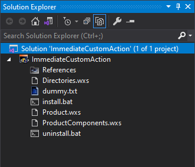
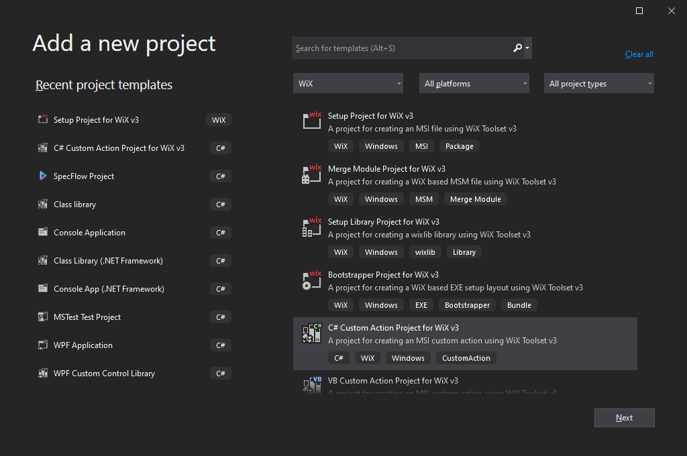
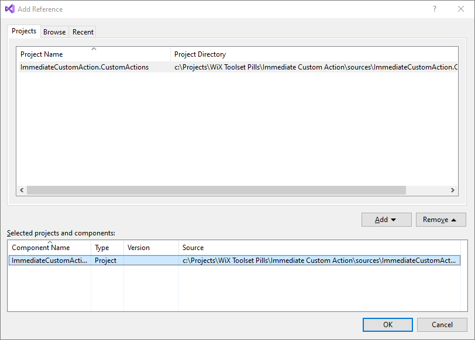
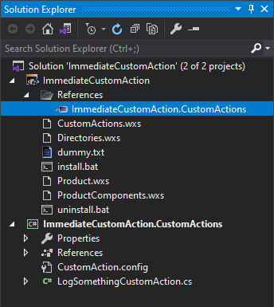
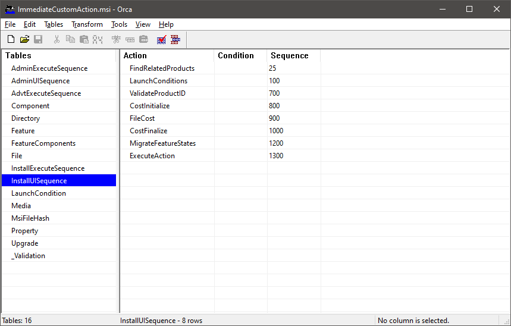
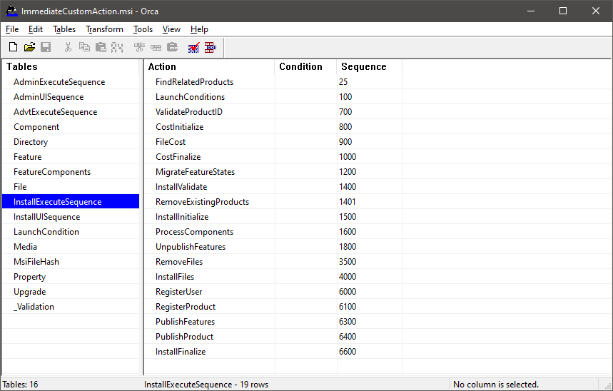
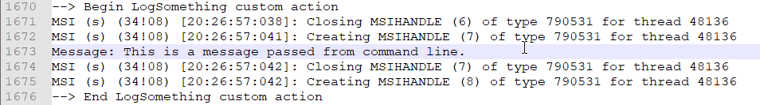

# Immediate Custom Action

## Description

This pill demonstrates how to create an immediate custom action.

> **Immediate Custom Action**
>
> An immediate custom action is executed exactly where it is placed in the install  sequence, as opposed to a deferred custom action that is just put in a list and it is executed at the end of the install sequence.

In this example we will create a custom action, let's call it `LogSomething` that writes a message into the log file. The message will be provided from the command line through a property called `MESSAGE`.

Let's begin.

## Implementation

### Step 0 - Create the installer project

Create a simple installer project that deploys a single dummy file. Let's call the project `ImmediateCustomAction`.



For more details regarding on how to do this, please see the tutorial:

- [My First Installer](https://github.com/WiX-Toolset-Pills-15mg/My-First-Installer)

### Step 1 - Create the `MESSAGE` property

```csharp
<Property Id="MESSAGE" Value="This is the default message." />
```

**Name:**

- This property is all uppercase. Windows Installer interprets this as being public, so it can be provided as argument from the command line.
- If the property name contains even a single lowercase character it will be interpreted as private.

**Default value:**

- We set also a default message for the case when the property is not actually from command line.
- The value of this property will be written in the log file later, by the custom action.

### Step 2 - Create the custom actions project

A custom action project is a class library with one particularity: it generates a `*.CA.dll` file as a wrapper over the normal .NET assembly. This is necessary because Windows Installer is not able to consume .NET assemblies directly. This `*.CA.dll` acts as an adapter between .NET and Windows Installer.

Add a new project in the solution of type "C# Custom Action Project for WiX v3":



This project will generate two important dll files at build time:

   - `<name>.dll` - a normal .NET class library assembly.
- `<name>.CA.dll` - a wrapper over the previously created .NET assembly that Windows Installer can consume.

### Step 3 - Implement the custom action

Create a public static method having the `CustomAction` attribute on it. It will be, later, referenced in the custom action tag from WiX:

```csharp
[CustomAction("LogSomething")]
public static ActionResult Execute(Session session)
{
    session.Log("--> Begin LogSomething custom action");
    try
    {
        string message = session["MESSAGE"];
        session.Log("Message: " + message);

        return ActionResult.Success;
    }
    finally
    {
        session.Log("--> End LogSomething custom action");
    }
}
```

The name of the custom action can be provider as parameter to the `CustomAction` attribute. In this case, it is `LogSomething`. If it is not provided explicitly, the custom action will take the name of the function: `Execute`.

The `session` instance provided as parameter can be used for retrieving the `MESSAGE` property and also for writing it into the log.

#### Retrieving the MESSAGE property

- **Immediate custom actions** - When the C# implementation is is associated with an immediate custom action as it is the case of our example, the installation session is available and properties can be easily retrieved from it by using the indexer operator:
  - `string message = session["MESSAGE"];`
- **Deferred custom action** - On the other hand, if the custom action is executed "deferred", by the time it actually gets executed, at the end of the installation process, the session is no longer available and the properties cannot be retrieved as shown in the current example. See the Deferred-Custom-Action pill for the solution to this problem:
  - [Deferred Custom Action](https://github.com/WiX-Toolset-Pills-15mg/Deferred-Custom-Action)

#### Writing into the log

- The `session` object provides the `Log(...)` method for writing messages into the log file.

- **Note**: This is a very basic method that just takes a text message. It laks the concept of multiple message types (like error, warning, info, etc...), so, if log message types are needed, they must be manually implemented.

- The logging must be activated in Windows Registry and its default location is the current user's temporary directory.
  - Type `echo %temp%` in a console to display the path to the user's temporary directory.
  - See more details on microsoft's page:
    - https://docs.microsoft.com/en-us/troubleshoot/windows-client/application-management/enable-windows-installer-logging
- Optionally, provide a custom location for the log file using the `/l` parameter in command line when installing an MSI. For example:
  - `msiexec /i MyInstaller.msi /l*vx install.log`

### Step 4 - Reference the custom action library

A reference to the library file (`*.CA.dll`) that contains the custom actions must be added:

- right click on the project -> Add -> Reference... -> Projects -> [the custom actions project's name] -> Add -> OK



The reference should be visible in the Solution Explorer:



### Step 5 - Add the `<Binary>` tag

The `<binary>` tag provides an alias for the dll that contains the implementation of the custom action. Instead of specifying the dll's path all over the WiX project, we create a `<Binary>` tag and use its `Id` instead.

```xml
<Binary
    Id="CustomActionsBinary"
    SourceFile="$(var.ImmediateCustomAction.CustomActions.TargetDir)$(var.ImmediateCustomAction.CustomActions.TargetName).CA.dll" />
```

When adding the custom action's project as a reference to the installer project , WiX Toolset is automatically creating a number
of useful variables like:

- `var.ImmediateCustomAction.CustomActions.TargetDir` - It contains the path to the custom action's dll. That `bin\Debug`or `bin\Release` where the project is built.
- `var.ImmediateCustomAction.CustomActions.TargetName` - It contains the name of the custom action's assembly. This is the name of the file without extension.

We prefer to use these constants instead of hard-codeing the paths.

### Step 6 - Create the custom action

```xml
<CustomAction
    Id="LogSomething"
    BinaryKey="CustomActionsBinary"
    DllEntry="LogSomething"
    Return="check"
    Execute="immediate" />
```

The custom action refers the static method previously implemented in C# by specifying:

- the binary library (`BinaryKey` attribute) and
- the name of the custom action (`DllEntry` attribute).

The `Return` and `Execute` attributes are optional; their default values being exactly the ones used in this example. I added them explicitly in order to also add a short explanation:

- `Return="check"` means that the return value of the custom action is verified and, if it represents a failure, the whole installation will stop. Prety much the expected behaviour, isn't it.
- `Execute="immediate"`, well, it is obvious. It specifies that we are creating an immediate custom action.

### Step 7 - Add custom action to the execution sequence

Just creating the custom action doesn't help much. We must schedule it to be executed in one of the sequences. For this example let's choose to execute the custom action on the server. It means we must add it into the `InstallExecuteSequence` that contains the list of actions executed on the server. Let's choose to add it after the existing `InstallFiles` custom action:

```xml
<InstallExecuteSequence>
    <Custom Action="LogSomething" After="InstallFiles" />
</InstallExecuteSequence>
```

I feel I must take a break here and explain a little bit what's up with these execution sequences (there are more of them, by the way) and this client/server concept.

#### Client Execution and `InstallUISequence`

The installation, when started, it runs under the current user's credentials. This is the client side execution.

- Its purpose is to gather all the information necessary for the product to be installed.
- Nothing should be changed on the target machine during this execution.
- Optionally, a GUI may be displayed in order to let the user customize the installation.
- Some checks and validations may be performed here to stop the installation early and avoid the unnecessary starting of the server if some conditions are not met.

The list of actions and the execution order are provided by a table in the MSI called `InstallUISequence`:



WiX Toolset is automatically adding populating this table with some necessary actions. They can be seen in the above screenshot.

##### How to include additional custom actions

We can add our own custom actions by using the `<InstallUISequence>` tag and the `After` or `Before` attributes to schedule our custom actions relative to the already existing ones. For example, if we want to schedule a custom action before the `ExecuteAction` we write:

```xml
<InstallUISequence>
    <Custom Action="MyAction" Before="ExecuteAction" />
</InstallUISequence>
```

##### The complete list of custom actions

Unfortunately, the complete list of custom actions from the sequences is not visible in the VIsual Studio project. So, the only way to see them is to compile the project and open it in Orca.

Actually, there is another way, also very useful. The list may be extracted from the log file after running the installer:

-  Create a dummy installer, run it, open the log file and search for all the `Action start` lines. That is the complete list of custom actions that were executed.

#### Server Execution and `InstallExecuteSequence`

If everything goes well on the client, the execution is switched to the server. The server will need elevated privileges in order to be able to actually install the product (files, registry keys, etc.). This is the moment when Windows will display the UAC window to ask for elevated privileges.

Similarly to the client execution we have a list of actions provided by a different table called `InstallExecuteSequence`:



If you remember the beginning of the step, we scheduled the custom action in this sequence, after the `InstallFiles`. Let's see that code again:

```xml
<InstallExecuteSequence>
    <Custom Action="LogSomething" After="InstallFiles" />
</InstallExecuteSequence>
```

### Step 8 - Run the installer

Now, the installer is complete. All it remains to do is to run it. Install the MSI using the following command:

```
msiexec /i ImmediateCustomAction.msi /l*vx install-with-message.log MESSAGE="This is a message passed from command line."
```

In the `install-with-message.log` file, search for the "Action Start [timestamp]: LogSomething." message. Our custom message should be present somewhere after that line:



